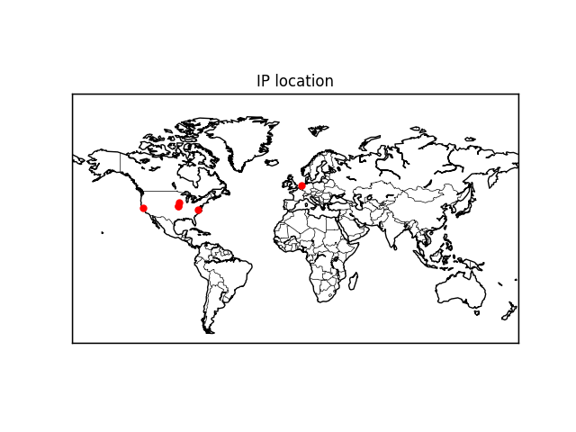
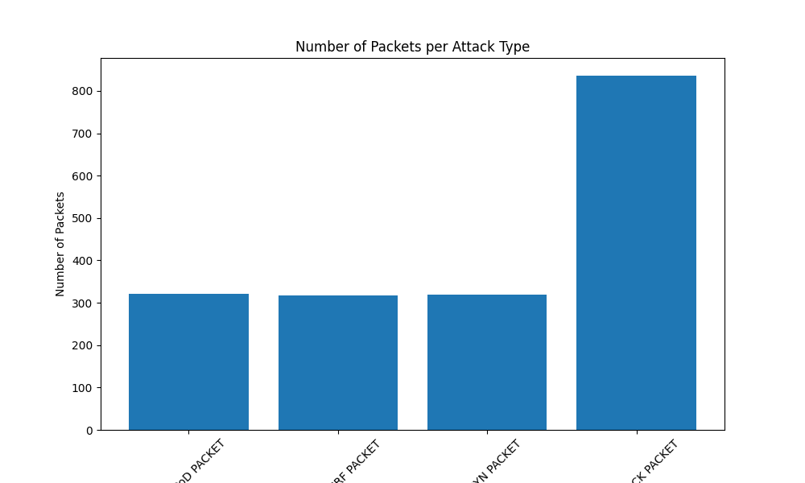
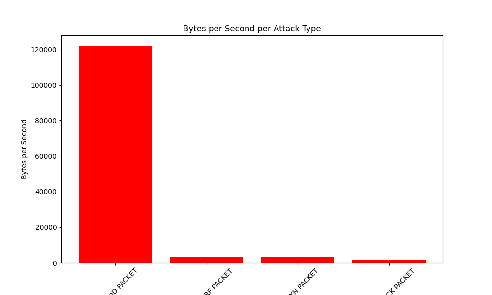
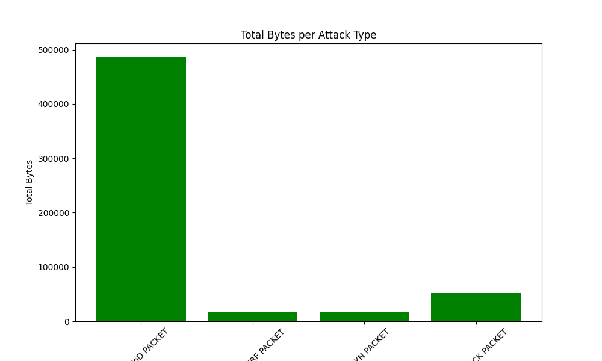
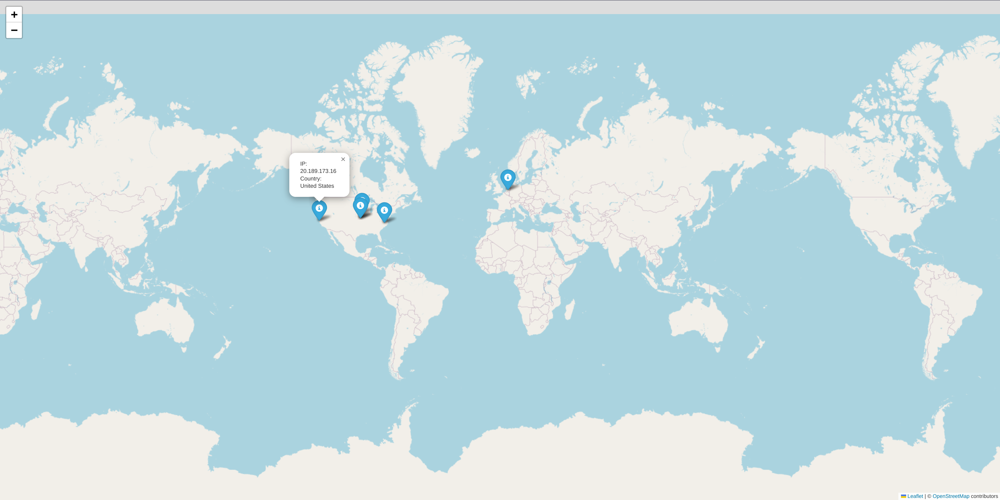

# ATTACKS PROJECT 2024 - Elise MARQUE

## Description of the project

In this project, we have to simulate and detect DOS attacks.

## Virtual environment

A virtual environment allows to install and manage dependencies without disturbing the Python installation at the system level.

At the project's rooot:

- Run the command to activate the virtual environment : `source myenv/bin/activate`

Then, install the required packages : `pip install -r requirements.txt`

## Attack script

You can find it at _DOS_Attack_Project/attacks.py_

This file simulates different types of Denial of Service (DOS) attacks against a specified target IP.

Launch command (model on Linux): `sudo python3 attacks.py <target_ip> <attack_type> <duration>`
example : sudo python3 attacks.py 192.168.1.25 syn_flood 5

## Detect attack script

You can find it at _DOS_Attack_Project/SniffnDetect/detect_attacks.py_

## CSV database

The detected attacks are logged into a local csv database (_DOS_Attack_Project/SniffnDetect/attack_log.csv_)

The CSV database has the following columns:

- Timestamp - Time when the attack happend
- Source IP - IP address of the attacker
- Destination IP - IP address of the attacked
- Protocol - Type of protocol used
- Source Port - Port of the attacker
- Destination Port - Port of the attacked
- Attack Type - Type of attack
- Packet Size - Size of the packet

## Data analyze

You can find it at _DOS_Attack_Project/SniffnDetect/analyze_data.py_

You can find the plot analyze in the plot Folder : _DOS_Attack_Project/SniffnDetect/Plot_analyze_

## IP location

### Get the ip location

You can find it at _DOS_Attack_Project/SniffnDetect/get_ip_locations.py_

### Analyze them to display them

You can find it at _DOS_Attack_Project/SniffnDetect/analyze_ip_loc.py_

You have two possibilities to see the ip's locations.

#### HTML: dynamic map

You can find it at _DOS_Attack_Project/SniffnDetect/Plot_analyze/suspect_ips_map.html_
You can see the ip's locations on a dynamic map just by clicking on the html file.

An Example:

#### Basemap : static map

## Jupiter Notebook

You can find it at _DOS_Attack_Project/SniffnDetect/Data_analyze.ipynb_

To see the output of the jupyter notebook, run this command in the SniffnDetect directory : `jupyter notebook Data_analyze.ipynb --allow-root`

if it doesn't work : `sudo apt-get install python3-tk`

## What were the difficulties?

- I would have liked to keep the directory SniffnDetect like it was on the github page (without my added scripts), but I didn't managed to import the module in my script.
